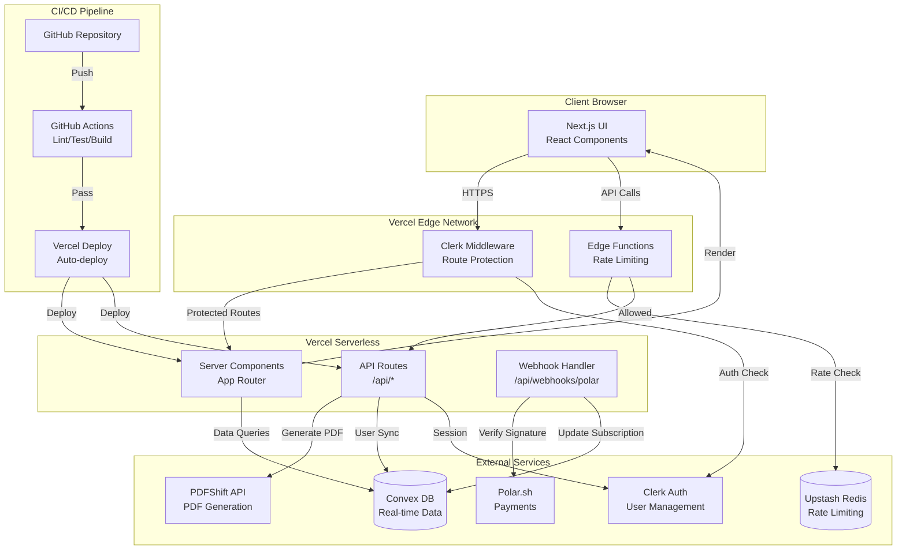
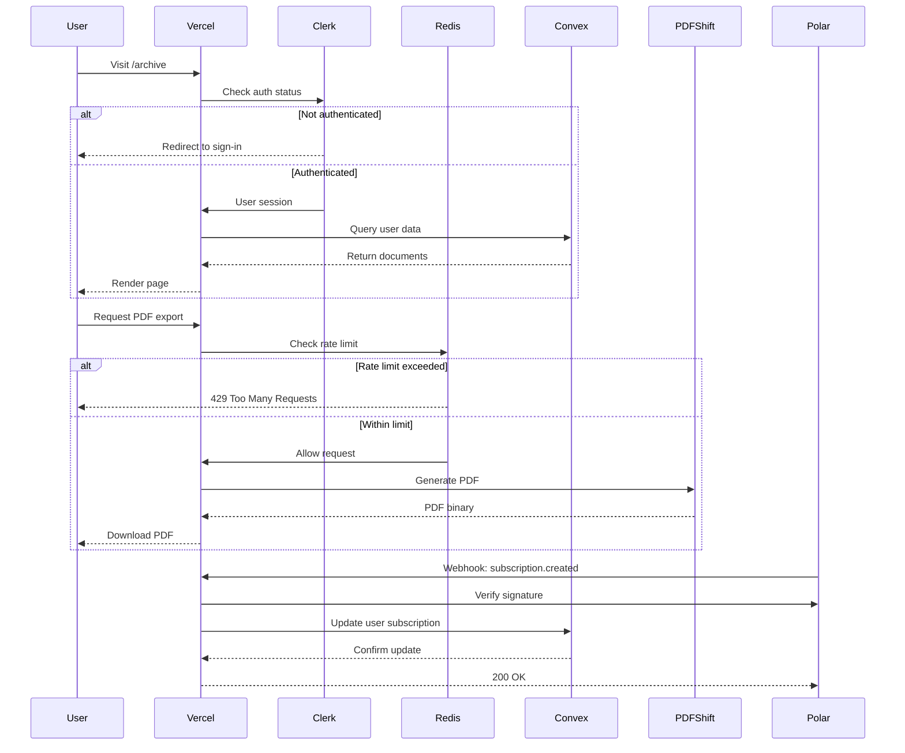

# Design Document: Phase 0 Foundation Setup

## Overview

Phase 0 establishes the complete technical foundation for Inkdown, a premium Markdown to PDF web application. This design covers the integration of six external services (Convex, Clerk, Upstash Redis, PDFShift, Polar, Vercel), the configuration of a modern Next.js 15 development environment, and the establishment of automated CI/CD pipelines.

The architecture follows a serverless model where Next.js API routes and server components handle business logic, Convex provides real-time data storage, Clerk manages authentication, Upstash Redis enforces rate limits, PDFShift generates PDFs server-side, and Polar processes payments. All components are deployed to Vercel with automatic deployments triggered by GitHub pushes.

This foundation prioritizes developer experience through TypeScript strict mode, comprehensive testing infrastructure, and clear separation of concerns. The design ensures that all service credentials remain server-side, rate limiting protects against abuse, and the CI/CD pipeline catches issues before deployment.

## Architecture

### High-Level System Architecture



### Service Integration Flow



## Components and Interfaces

### 1. Next.js Application Structure

```
inkdown/
├── app/
│   ├── layout.tsx              # Root layout with Clerk provider
│   ├── page.tsx                # Homepage route
│   ├── archive/
│   │   └── page.tsx            # Protected archive route
│   ├── api/
│   │   ├── pdf/
│   │   │   └── route.ts        # PDF generation endpoint
│   │   └── webhooks/
│   │       └── polar/
│   │           └── route.ts    # Polar webhook handler
│   └── globals.css             # Tailwind directives
├── components/
│   ├── ui/                     # shadcn/ui components
│   └── providers/
│       └── convex-clerk-provider.tsx
├── lib/
│   ├── utils.ts                # Utility functions
│   ├── env.ts                  # Environment variable validation
│   ├── rate-limit.ts           # Rate limiting logic
│   └── pdf.ts                  # PDF generation wrapper
├── convex/
│   ├── schema.ts               # Convex database schema
│   ├── users.ts                # User management functions
│   └── _generated/             # Auto-generated types
├── public/
│   └── favicon.ico
├── .github/
│   └── workflows/
│       └── ci.yml              # GitHub Actions pipeline
├── package.json
├── tsconfig.json
├── tailwind.config.ts
├── components.json
├── vitest.config.ts
├── .env.local.example
└── README.md
```

### 2. Configuration Files

#### tsconfig.json
```json
{
  "compilerOptions": {
    "target": "ES2022",
    "lib": ["dom", "dom.iterable", "esnext"],
    "allowJs": true,
    "skipLibCheck": true,
    "strict": true,
    "noEmit": true,
    "esModuleInterop": true,
    "module": "esnext",
    "moduleResolution": "bundler",
    "resolveJsonModule": true,
    "isolatedModules": true,
    "jsx": "preserve",
    "incremental": true,
    "plugins": [
      {
        "name": "next"
      }
    ],
    "paths": {
      "@/*": ["./*"]
    }
  },
  "include": ["next-env.d.ts", "**/*.ts", "**/*.tsx", ".next/types/**/*.ts"],
  "exclude": ["node_modules"]
}
```

#### tailwind.config.ts
```typescript
import type { Config } from "tailwindcss"

const config: Config = {
  darkMode: "class",
  content: [
    "./pages/**/*.{ts,tsx}",
    "./components/**/*.{ts,tsx}",
    "./app/**/*.{ts,tsx}",
  ],
  theme: {
    extend: {
      colors: {
        border: "hsl(var(--border))",
        input: "hsl(var(--input))",
        ring: "hsl(var(--ring))",
        background: "hsl(var(--background))",
        foreground: "hsl(var(--foreground))",
        primary: {
          DEFAULT: "hsl(var(--primary))",
          foreground: "hsl(var(--primary-foreground))",
        },
        secondary: {
          DEFAULT: "hsl(var(--secondary))",
          foreground: "hsl(var(--secondary-foreground))",
        },
        destructive: {
          DEFAULT: "hsl(var(--destructive))",
          foreground: "hsl(var(--destructive-foreground))",
        },
        muted: {
          DEFAULT: "hsl(var(--muted))",
          foreground: "hsl(var(--muted-foreground))",
        },
        accent: {
          DEFAULT: "hsl(var(--accent))",
          foreground: "hsl(var(--accent-foreground))",
        },
        popover: {
          DEFAULT: "hsl(var(--popover))",
          foreground: "hsl(var(--popover-foreground))",
        },
        card: {
          DEFAULT: "hsl(var(--card))",
          foreground: "hsl(var(--card-foreground))",
        },
      },
      borderRadius: {
        lg: "var(--radius)",
        md: "calc(var(--radius) - 2px)",
        sm: "calc(var(--radius) - 4px)",
      },
    },
  },
  plugins: [require("tailwindcss-animate")],
}

export default config
```

#### vitest.config.ts
```typescript
import { defineConfig } from 'vitest/config'
import react from '@vitejs/plugin-react'
import path from 'path'

export default defineConfig({
  plugins: [react()],
  test: {
    environment: 'jsdom',
    globals: true,
    setupFiles: ['./vitest.setup.ts'],
  },
  resolve: {
    alias: {
      '@': path.resolve(__dirname, './'),
    },
  },
})
```

#### components.json
```json
{
  "$schema": "https://ui.shadcn.com/schema.json",
  "style": "default",
  "rsc": true,
  "tsx": true,
  "tailwind": {
    "config": "tailwind.config.ts",
    "css": "app/globals.css",
    "baseColor": "zinc",
    "cssVariables": true,
    "prefix": ""
  },
  "aliases": {
    "components": "@/components",
    "utils": "@/lib/utils"
  }
}
```

### 3. Environment Variables Schema

```typescript
// lib/env.ts
import { z } from 'zod'

const envSchema = z.object({
  // Convex
  CONVEX_DEPLOYMENT: z.string().min(1),
  NEXT_PUBLIC_CONVEX_URL: z.string().url(),
  
  // Clerk
  NEXT_PUBLIC_CLERK_PUBLISHABLE_KEY: z.string().startsWith('pk_'),
  CLERK_SECRET_KEY: z.string().startsWith('sk_'),
  
  // Upstash Redis
  UPSTASH_REDIS_REST_URL: z.string().url(),
  UPSTASH_REDIS_REST_TOKEN: z.string().min(1),
  
  // PDFShift
  PDFSHIFT_API_KEY: z.string().min(1),
  
  // Polar
  POLAR_ACCESS_TOKEN: z.string().min(1),
  POLAR_WEBHOOK_SECRET: z.string().min(1),
  
  // Node environment
  NODE_ENV: z.enum(['development', 'production', 'test']).default('development'),
})

export type Env = z.infer<typeof envSchema>

export function validateEnv(): Env {
  try {
    return envSchema.parse(process.env)
  } catch (error) {
    if (error instanceof z.ZodError) {
      const missing = error.errors.map(e => e.path.join('.')).join(', ')
      throw new Error(`Missing or invalid environment variables: ${missing}`)
    }
    throw error
  }
}
```

### 4. Clerk Middleware Configuration

```typescript
// middleware.ts
import { clerkMiddleware, createRouteMatcher } from '@clerk/nextjs/server'

const isProtectedRoute = createRouteMatcher([
  '/archive(.*)',
])

export default clerkMiddleware((auth, req) => {
  if (isProtectedRoute(req)) {
    auth().protect()
  }
})

export const config = {
  matcher: [
    '/((?!_next|[^?]*\\.(?:html?|css|js(?!on)|jpe?g|webp|png|gif|svg|ttf|woff2?|ico|csv|docx?|xlsx?|zip|webmanifest)).*)',
    '/(api|trpc)(.*)',
  ],
}
```

### 5. Rate Limiting Implementation

```typescript
// lib/rate-limit.ts
import { Ratelimit } from '@upstash/ratelimit'
import { Redis } from '@upstash/redis'

const redis = new Redis({
  url: process.env.UPSTASH_REDIS_REST_URL!,
  token: process.env.UPSTASH_REDIS_REST_TOKEN!,
})

// 10 PDF exports per 10 minutes per IP
export const pdfRateLimit = new Ratelimit({
  redis,
  limiter: Ratelimit.slidingWindow(10, '10 m'),
  analytics: true,
  prefix: 'ratelimit:pdf',
})

export async function checkRateLimit(identifier: string): Promise<{
  success: boolean
  limit: number
  remaining: number
  reset: number
}> {
  const { success, limit, remaining, reset } = await pdfRateLimit.limit(identifier)
  return { success, limit, remaining, reset }
}
```

### 6. PDF Generation Wrapper

```typescript
// lib/pdf.ts
import { validateEnv } from './env'

export interface PDFOptions {
  html: string
  filename?: string
  landscape?: boolean
  format?: 'A4' | 'Letter'
}

export async function generatePDF(options: PDFOptions): Promise<Buffer> {
  const env = validateEnv()
  
  const response = await fetch('https://api.pdfshift.io/v3/convert/pdf', {
    method: 'POST',
    headers: {
      'Content-Type': 'application/json',
      'Authorization': `Basic ${Buffer.from(`api:${env.PDFSHIFT_API_KEY}`).toString('base64')}`,
    },
    body: JSON.stringify({
      source: options.html,
      landscape: options.landscape ?? false,
      format: options.format ?? 'A4',
    }),
  })
  
  if (!response.ok) {
    const error = await response.text()
    throw new Error(`PDFShift API error: ${error}`)
  }
  
  const arrayBuffer = await response.arrayBuffer()
  return Buffer.from(arrayBuffer)
}
```

### 7. Polar Webhook Handler

```typescript
// app/api/webhooks/polar/route.ts
import { NextRequest, NextResponse } from 'next/server'
import { validateWebhookSignature } from '@polar-sh/sdk/webhooks'
import { api } from '@/convex/_generated/api'
import { ConvexHttpClient } from 'convex/browser'

const convex = new ConvexHttpClient(process.env.NEXT_PUBLIC_CONVEX_URL!)

export async function POST(req: NextRequest) {
  const body = await req.text()
  const signature = req.headers.get('webhook-signature')
  
  if (!signature) {
    return NextResponse.json({ error: 'Missing signature' }, { status: 401 })
  }
  
  try {
    const event = validateWebhookSignature({
      payload: body,
      signature,
      secret: process.env.POLAR_WEBHOOK_SECRET!,
    })
    
    switch (event.type) {
      case 'subscription.created':
      case 'subscription.updated':
        await convex.mutation(api.users.updateSubscription, {
          userId: event.data.customer_id,
          subscriptionId: event.data.id,
          status: event.data.status,
        })
        break
        
      case 'checkout.completed':
        await convex.mutation(api.users.handleCheckout, {
          userId: event.data.customer_id,
          checkoutId: event.data.id,
        })
        break
    }
    
    return NextResponse.json({ received: true })
  } catch (error) {
    console.error('Webhook error:', error)
    return NextResponse.json({ error: 'Invalid signature' }, { status: 401 })
  }
}
```

## Data Models

### Convex Schema

```typescript
// convex/schema.ts
import { defineSchema, defineTable } from 'convex/server'
import { v } from 'convex/values'

export default defineSchema({
  users: defineTable({
    clerkId: v.string(),
    email: v.string(),
    name: v.optional(v.string()),
    subscriptionId: v.optional(v.string()),
    subscriptionStatus: v.optional(v.union(
      v.literal('active'),
      v.literal('canceled'),
      v.literal('past_due'),
      v.literal('trialing')
    )),
    createdAt: v.number(),
    updatedAt: v.number(),
  })
    .index('by_clerk_id', ['clerkId'])
    .index('by_email', ['email']),
})
```

### Environment Variables Structure

```bash
# .env.local.example

# Convex
CONVEX_DEPLOYMENT=your-deployment-name
NEXT_PUBLIC_CONVEX_URL=https://your-deployment.convex.cloud

# Clerk
NEXT_PUBLIC_CLERK_PUBLISHABLE_KEY=pk_test_...
CLERK_SECRET_KEY=sk_test_...

# Upstash Redis
UPSTASH_REDIS_REST_URL=https://your-redis.upstash.io
UPSTASH_REDIS_REST_TOKEN=your-token

# PDFShift
PDFSHIFT_API_KEY=your-api-key

# Polar
POLAR_ACCESS_TOKEN=polar_at_...
POLAR_WEBHOOK_SECRET=whsec_...

# Node Environment
NODE_ENV=development
```


### 8. GitHub Actions CI/CD Pipeline

```yaml
# .github/workflows/ci.yml
name: CI

on:
  push:
    branches: ['**']
  pull_request:
    branches: ['**']

jobs:
  ci:
    runs-on: ubuntu-latest
    timeout-minutes: 10
    
    steps:
      - name: Checkout code
        uses: actions/checkout@v4
      
      - name: Setup Node.js
        uses: actions/setup-node@v4
        with:
          node-version: '20'
          cache: 'npm'
      
      - name: Install dependencies
        run: npm ci
      
      - name: Lint
        run: npm run lint
      
      - name: Type check
        run: npm run type-check
      
      - name: Run tests
        run: npm run test
      
      - name: Build
        run: npm run build
        env:
          # Mock environment variables for build
          CONVEX_DEPLOYMENT: ci-test
          NEXT_PUBLIC_CONVEX_URL: https://ci-test.convex.cloud
          NEXT_PUBLIC_CLERK_PUBLISHABLE_KEY: pk_test_ci
          CLERK_SECRET_KEY: sk_test_ci
          UPSTASH_REDIS_REST_URL: https://ci-test.upstash.io
          UPSTASH_REDIS_REST_TOKEN: ci-test-token
          PDFSHIFT_API_KEY: ci-test-key
          POLAR_ACCESS_TOKEN: polar_at_ci
          POLAR_WEBHOOK_SECRET: whsec_ci
```

### 9. Package.json Scripts

```json
{
  "name": "inkdown",
  "version": "0.1.0",
  "private": true,
  "scripts": {
    "dev": "next dev",
    "build": "next build",
    "start": "next start",
    "lint": "next lint",
    "type-check": "tsc --noEmit",
    "test": "vitest --run",
    "test:watch": "vitest",
    "test:ui": "vitest --ui"
  },
  "dependencies": {
    "next": "^15.0.0",
    "react": "^18.3.0",
    "react-dom": "^18.3.0",
    "@clerk/nextjs": "^5.0.0",
    "@polar-sh/sdk": "^0.9.0",
    "@upstash/redis": "^1.28.0",
    "@upstash/ratelimit": "^1.0.0",
    "@uiw/react-codemirror": "^4.21.0",
    "@codemirror/lang-markdown": "^6.2.0",
    "convex": "^1.14.0",
    "framer-motion": "^11.0.0",
    "lucide-react": "^0.344.0",
    "zod": "^3.22.0",
    "class-variance-authority": "^0.7.0",
    "clsx": "^2.1.0",
    "tailwind-merge": "^2.2.0",
    "tailwindcss-animate": "^1.0.7",
    "@vercel/analytics": "^1.1.0"
  },
  "devDependencies": {
    "typescript": "^5.3.0",
    "@types/node": "^20.11.0",
    "@types/react": "^18.2.0",
    "@types/react-dom": "^18.2.0",
    "tailwindcss": "^3.4.0",
    "postcss": "^8.4.0",
    "autoprefixer": "^10.4.0",
    "eslint": "^8.56.0",
    "eslint-config-next": "^15.0.0",
    "vitest": "^1.2.0",
    "@vitejs/plugin-react": "^4.2.0",
    "@testing-library/react": "^14.1.0",
    "@testing-library/jest-dom": "^6.2.0",
    "@testing-library/user-event": "^14.5.0",
    "jsdom": "^24.0.0"
  }
}
```

### 10. Root Layout with Providers

```typescript
// app/layout.tsx
import type { Metadata } from 'next'
import { Inter } from 'next/font/google'
import { ClerkProvider } from '@clerk/nextjs'
import { ConvexClientProvider } from '@/components/providers/convex-clerk-provider'
import { Analytics } from '@vercel/analytics/react'
import './globals.css'

const inter = Inter({ subsets: ['latin'] })

export const metadata: Metadata = {
  title: 'Inkdown - Premium Markdown to PDF',
  description: 'Transform your Markdown into beautiful PDFs',
}

export default function RootLayout({
  children,
}: {
  children: React.ReactNode
}) {
  return (
    <ClerkProvider>
      <html lang="en" className="dark">
        <body className={inter.className}>
          <ConvexClientProvider>
            {children}
          </ConvexClientProvider>
          <Analytics />
        </body>
      </html>
    </ClerkProvider>
  )
}
```

### 11. Convex-Clerk Provider Integration

```typescript
// components/providers/convex-clerk-provider.tsx
'use client'

import { ClerkProvider, useAuth } from '@clerk/nextjs'
import { ConvexProviderWithClerk } from 'convex/react-clerk'
import { ConvexReactClient } from 'convex/react'
import { ReactNode } from 'react'

const convex = new ConvexReactClient(process.env.NEXT_PUBLIC_CONVEX_URL!)

export function ConvexClientProvider({ children }: { children: ReactNode }) {
  return (
    <ConvexProviderWithClerk client={convex} useAuth={useAuth}>
      {children}
    </ConvexProviderWithClerk>
  )
}
```

## Error Handling

### 1. Service Integration Failures

All external service calls must implement graceful error handling with user-facing messages:

```typescript
// Pattern for service error handling
try {
  const result = await externalServiceCall()
  return result
} catch (error) {
  console.error('Service error:', error)
  
  if (error instanceof ServiceSpecificError) {
    throw new Error('User-friendly message explaining what went wrong')
  }
  
  throw new Error('An unexpected error occurred. Please try again later.')
}
```

### 2. Environment Variable Validation

The application must fail fast on startup if required environment variables are missing:

```typescript
// Call in app initialization
import { validateEnv } from '@/lib/env'

// This will throw if any required variables are missing
const env = validateEnv()
```

### 3. Rate Limit Handling

API routes must check rate limits before processing requests:

```typescript
// app/api/pdf/route.ts
import { checkRateLimit } from '@/lib/rate-limit'
import { NextRequest, NextResponse } from 'next/server'

export async function POST(req: NextRequest) {
  const ip = req.ip ?? req.headers.get('x-forwarded-for') ?? 'unknown'
  const { success, remaining, reset } = await checkRateLimit(ip)
  
  if (!success) {
    return NextResponse.json(
      { 
        error: 'Rate limit exceeded',
        remaining: 0,
        resetAt: new Date(reset).toISOString()
      },
      { 
        status: 429,
        headers: {
          'X-RateLimit-Limit': '10',
          'X-RateLimit-Remaining': '0',
          'X-RateLimit-Reset': reset.toString(),
        }
      }
    )
  }
  
  // Process request
  // ...
}
```

### 4. Webhook Signature Verification

All webhook handlers must verify signatures before processing:

```typescript
// Pattern for webhook verification
const signature = req.headers.get('webhook-signature')

if (!signature) {
  return NextResponse.json({ error: 'Missing signature' }, { status: 401 })
}

try {
  const event = verifySignature(body, signature, secret)
  // Process event
} catch (error) {
  console.error('Invalid webhook signature:', error)
  return NextResponse.json({ error: 'Invalid signature' }, { status: 401 })
}
```

### 5. Build-Time Error Detection

The CI pipeline must catch errors before deployment:

- ESLint catches code quality issues
- TypeScript catches type errors
- Vitest catches test failures
- Next.js build catches runtime errors

If any check fails, the pipeline fails and prevents deployment.

## Testing Strategy

### Dual Testing Approach

The project uses both unit tests and property-based tests for comprehensive coverage:

- **Unit tests**: Verify specific examples, edge cases, and error conditions
- **Property tests**: Verify universal properties across randomized inputs

Unit tests focus on integration points, specific examples, and edge cases. Property tests handle comprehensive input coverage through randomization. Together they provide both concrete bug detection and general correctness verification.

### Test Infrastructure

- **Test Runner**: Vitest with jsdom environment
- **Component Testing**: @testing-library/react for React components
- **Assertions**: @testing-library/jest-dom for DOM assertions
- **Property Testing**: fast-check library (minimum 100 iterations per test)

### Property Test Configuration

Each property-based test must:
- Run minimum 100 iterations due to randomization
- Reference its design document property in a comment
- Use tag format: `// Feature: phase-0-foundation-setup, Property {number}: {property_text}`

### Test Organization

```
__tests__/
├── unit/
│   ├── env.test.ts              # Environment validation
│   ├── rate-limit.test.ts       # Rate limiting logic
│   └── pdf.test.ts              # PDF generation wrapper
├── integration/
│   ├── api-routes.test.ts       # API endpoint behavior
│   └── middleware.test.ts       # Clerk middleware
└── properties/
    ├── env-validation.property.test.ts
    ├── rate-limit.property.test.ts
    └── webhook-signature.property.test.ts
```

### Example Test Structure

```typescript
// __tests__/unit/env.test.ts
import { describe, it, expect } from 'vitest'
import { validateEnv } from '@/lib/env'

describe('Environment validation', () => {
  it('should throw when CONVEX_DEPLOYMENT is missing', () => {
    const originalEnv = process.env.CONVEX_DEPLOYMENT
    delete process.env.CONVEX_DEPLOYMENT
    
    expect(() => validateEnv()).toThrow('Missing or invalid environment variables')
    
    process.env.CONVEX_DEPLOYMENT = originalEnv
  })
  
  it('should throw when CLERK_SECRET_KEY does not start with sk_', () => {
    const originalKey = process.env.CLERK_SECRET_KEY
    process.env.CLERK_SECRET_KEY = 'invalid_key'
    
    expect(() => validateEnv()).toThrow('Missing or invalid environment variables')
    
    process.env.CLERK_SECRET_KEY = originalKey
  })
})
```


## Correctness Properties

*A property is a characteristic or behavior that should hold true across all valid executions of a system—essentially, a formal statement about what the system should do. Properties serve as the bridge between human-readable specifications and machine-verifiable correctness guarantees.*

### Property Reflection

After analyzing all acceptance criteria, I identified the following testable properties. Many criteria are structural checks (file existence, configuration values) that are better suited as examples rather than properties. The true properties emerge around:

1. **Environment validation behavior**: How the system responds to missing or invalid environment variables
2. **Security invariants**: Ensuring secrets never leak to client-side code
3. **Error handling patterns**: How service wrappers handle and transform errors
4. **Webhook security**: Signature verification behavior across different inputs

Redundancy elimination:
- Multiple criteria check for dependency existence (1.4, 4.1, 5.1, 6.1, etc.) - these are all examples, not properties
- Multiple criteria check for environment variable requirements (4.3, 4.4, 5.3, 5.4, etc.) - consolidated into one property about validation behavior
- File structure checks (14.1-14.8) are all examples
- Configuration checks (10.2, 10.3, 10.4) are all examples

The properties below focus on universal behaviors that should hold across all inputs, not specific configuration checks.

### Property 1: Environment Validation Fails Fast

*For any* incomplete set of environment variables, when the validation function is called, the system should throw an error that clearly identifies which variables are missing or invalid.

**Validates: Requirements 9.4**

### Property 2: Client-Side Secret Exclusion

*For any* file in the client-side bundle (app/ components with 'use client', or any NEXT_PUBLIC_ environment variable), the PDFShift API key should never appear in the compiled output.

**Validates: Requirements 7.3**

### Property 3: PDF Error Transformation

*For any* error thrown by the PDFShift API, the PDF generation wrapper should catch it and throw a new error with a user-friendly message that does not expose internal API details.

**Validates: Requirements 7.5**

### Property 4: Webhook Signature Rejection

*For any* webhook request without a valid signature, the webhook handler should return a 401 status code and not process the webhook payload.

**Validates: Requirements 8.5**

### Property 5: Rate Limit Response Headers

*For any* rate-limited request, the API response should include X-RateLimit-Limit, X-RateLimit-Remaining, and X-RateLimit-Reset headers with valid numeric values.

**Validates: Requirements 6.5** (implied by rate limiting implementation)

### Example-Based Tests

The following acceptance criteria are best tested with specific examples rather than properties:

- **Dependency verification**: Check that specific packages exist in package.json (1.4, 4.1, 5.1, 6.1, 8.1, 10.1, 11.1-11.4, 12.1-12.3, 15.1)
- **Configuration verification**: Check that config files have correct values (1.2, 10.2-10.6, 12.4, 12.6)
- **File structure verification**: Check that required files and directories exist (1.6, 2.1, 2.4, 4.2, 4.6, 5.2, 6.5, 7.2, 8.4, 8.6, 9.1, 9.5, 14.1-14.8, 15.2, 17.4, 18.1-18.7)
- **CI pipeline verification**: Check that workflow file contains required steps (13.1-13.7)

These are important for Phase 0 completion but don't require property-based testing since they verify specific, deterministic configuration values.


## Implementation Notes

### Setup Sequence

The foundation setup should follow this order to minimize configuration issues:

1. **Initialize Next.js project** with TypeScript and App Router
2. **Configure Git** and create GitHub repository
3. **Set up Vercel deployment** and connect to GitHub
4. **Install and configure Convex** (requires Vercel deployment for production URL)
5. **Install and configure Clerk** (requires Vercel deployment for callback URLs)
6. **Install and configure Upstash Redis** (can be done independently)
7. **Set up PDFShift account** and add API key
8. **Set up Polar.sh account** and configure webhooks
9. **Configure environment variables** in both .env.local and Vercel
10. **Set up Tailwind CSS and shadcn/ui** with zinc palette and dark mode
11. **Install additional UI dependencies** (Framer Motion, Lucide, CodeMirror)
12. **Configure test infrastructure** (Vitest, Testing Library)
13. **Create GitHub Actions workflow** for CI/CD
14. **Verify build and deployment** end-to-end

### Critical Configuration Points

1. **Clerk Middleware**: Must be configured before any protected routes are accessed
2. **Convex Schema**: Must be deployed before the application can query data
3. **Environment Variables**: Must be set in Vercel before deployment succeeds
4. **Rate Limiting**: Redis connection must be established before rate limit checks
5. **Webhook Endpoints**: Must be registered in Polar dashboard with correct URL

### Development Workflow

Once Phase 0 is complete, the development workflow will be:

1. Create feature branch from main
2. Make changes locally with `npm run dev`
3. Run tests with `npm run test`
4. Commit with conventional commit format
5. Push to GitHub (triggers CI pipeline)
6. CI runs lint, type-check, test, and build
7. If CI passes, merge to main
8. Vercel auto-deploys to production

### Verification Checklist

Before considering Phase 0 complete, verify:

- [ ] `npm run dev` starts without errors
- [ ] `npm run build` completes successfully
- [ ] `npm run test` passes all tests
- [ ] `npm run lint` shows no errors
- [ ] `npm run type-check` shows no errors
- [ ] GitHub Actions CI pipeline passes
- [ ] Application is accessible at https://inkdown.app
- [ ] Homepage returns HTTP 200
- [ ] /archive route redirects unauthenticated users to Clerk sign-in
- [ ] All environment variables are set in Vercel
- [ ] Convex schema is deployed and generating types
- [ ] README.md contains complete setup instructions
- [ ] .env.local.example documents all required variables

